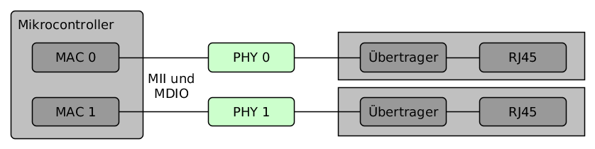
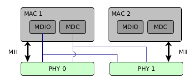

Vor längerer Zeit habe ich mich beruflich mit der Anbindung einer Fast
Ethernet-Schnittstelle an ein Embedded Device auseinandergesetzt. Aus Sicht der Software waren hier die PHY-Register ein wichtiges Hilfsmittel. Der Zugriff geschieht über die genormte MDIO-Schnittstelle, die ich hier mit ein paar Hintergrundinformationen beschreibe.

# Einführung

Üblicherweise ist die Netzwerkanbindung eines (eingebetteten) Systems mehrstufig aufgebaut und besteht aus mehreren Komponenten. Betrachtet man das System vom Netzwerk aus, so durchläuft das Signal zunächst die bekannte 8-polige RJ45-Buchse, die es mit und ohne integrierte Übertrager (engl: *magnetics*) gibt. Sie bildet die physikalische Schnittstelle zum Netzwerk. Die Buchse ist mit einem Chip verbunden, der in der Regel mit *PHY* abgekürzt wird und das analoge Netzwerksignal
in ein digitales Signal umwandelt. Über einen speziellen Bus (MII und MDIO) ist die PHY mit dem MAC verbunden, der oft bereits im Controller integriert ist und unter anderem die Paketbildung regelt.

Das nachfolgende Bild zeigt einen ersten Überblick über die Komponenten. Dies ist nur eine Möglichkeit, da es zum Beispiel Abwandlungen des MII-Bus mit geringerem Leitungsbedarf gibt (Reduced MII). Die MDIO-Schnittstelle eines MAC kann zur Verwaltung mehrerer PHY eingesetzt werden und muss keine 1-zu-1-Verbindung sein.

# Aufgaben der PHY

Die PHY ist das physikalische Bindeglied zwischen der Ethernet-MAC und der RJ45-Buchse. Sie ist für die Kodierung und Dekodierung von Daten zwischen einem rein digitalen Signal und einem modulierten analogen Signal zuständig, das heißt für das Versenden und Empfangen der Ethernet-Datenpakete als seriellen Bitstrom über das LAN-Kabel. In einem Fast Ethernet (also 10/100-Mbit/s-LAN) übernimmt die PHY bei Bedarf auch die automatische Geschwindigkeitserkennung zwischen zwei Teilnehmern (*Auto Negotiation*). Es ist (wie immer) sehr aufschlussreich sich einmal ein paar Datenblätter von namenhaften Anbietern wie [Microchip], [Intel] oder [Texas Instruments] anzuschauen, weil diese noch einige Hintergünde, Timings und erweiterte Funktionen wie die Kabeldiagnose beschreiben.

# Aufgaben des MAC

Der MAC (*Media Access Controller*) ist häufig schon in einem Mikrocontroller integriert und ist grob gesagt für die Verarbeitung der eingehenden und ausgehenden Frames zuständig. Weiterhin übernimmt der MAC die CRC-Bildung und -Prüfung für die Pakete. Für diesen Artikel ist das zentrale Merkmal die Management-Schnittstelle, die aus zwei Leitungen besteht: die Datenleitung MDIO und die Taktleitung MDC. Um die Funktionsvielfalt dieser Komponente kennenzulernen lohnt sich auch hier
wieder ein Blick in das Datenblatt eines Controllers mit MAC wie zum Beispiel dem [Atmel SAM3X].

# Das PHY-Management-Interface

Zur Konfiguration und Überwachung der PHY existiert das Management-Interface, welches in dem MAC integriert ist und ursprünglich im IEEE 802.3 Abschnitt 22 für Fast Ethernet spezifiziert wurde. Später folgte eine Erweiterung in Abschnitt 45 um wachsende Anforderungen an Gigabit-Netzwerke erfüllen zu können.

Es handelt sich bei dem Interface um einen seriellen 2-Draht-Bus mit einem Clock-Signal MDC (maximale Frequenz 2,5 MHz) und dem Daten-Signal MDIO. Der MAC tritt dabei als Master auf und kann bis zu 32 Slaves (also 32 PHY-Chips) verwalten. Die MII-Schnittstelle ist natürlich für jede PHY einzeln notwendig, da hier die eigentlichen Netzwerkdaten übertragen werden. Das nächste Bild skizziert dies.

# Das Statusregister

Der MII-Transceiver hat 32 Register. Die ersten 16 sind im IEEE-Standard festgelegt, die restlichen sind für herstellerabhängige Erweiterungen. Für die Diagnose besonders interessant ist das Register 0x01 (*BMSR*) da hier die aktuellen Werte der PHY enthalten sind: Ein gutes Zeichen ist es in der Regel wenn der Wert 0x784D in diesem Register steht, da dann das Link Bit gesetzt ist. Dieses signalisiert einen abgeschlossenen Verbindungsaufbau zwischen zwei Teilnehmern. Was genau das bedeutet ist abhängig von dem physikalischem Medium. Ein weiteres interessantes Bit im BMSR-Register ist das Bit 10, welches einen vollendeten Auto-Negotiation-Vorgang anzeigt. Die komplette Beschreibung dieses und der anderen normierten Register der PHY lassen sich im [offiziellen Standard] nachlesen.

# Literatur

[1] IEEE 802.3.1-2013 Standard for Management Information Base (MIB) Definitions for Ethernet

[Microchip]:http://www.microchip.com/design-centers/ethernet/ethernet-devices/products/ethernet-phys
[Texas Instruments]:http://www.ti.com/lsds/ti/interface/ethernet-overview.page
[Intel]:http://www.intel.de
[Atmel SAM3X]:http://www.atmel.com/devices/SAM3X4C.aspx
[offiziellen Standard]:https://standards.ieee.org/about/get/802/802.3.html
[bmsrdecode]:https://github.com/DSiekmeier/bmsrdecode
